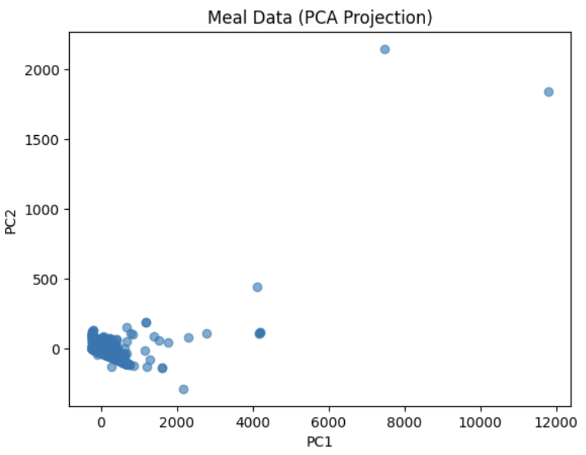
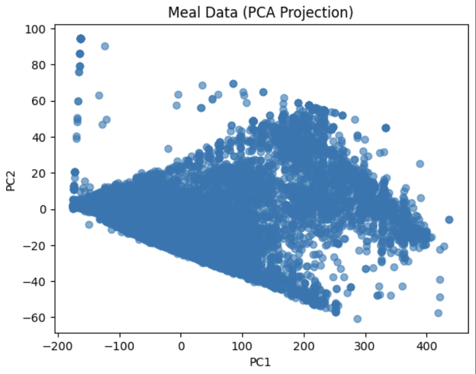
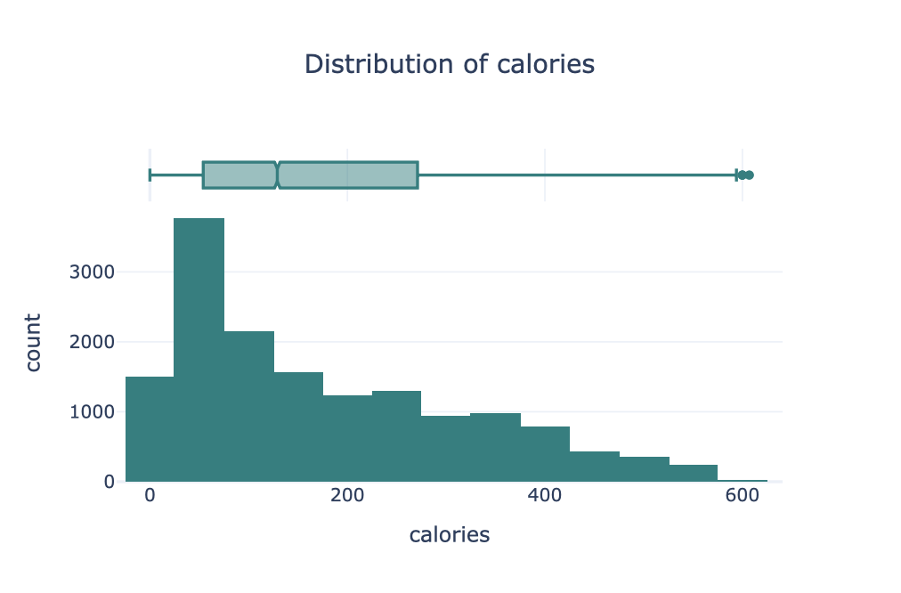
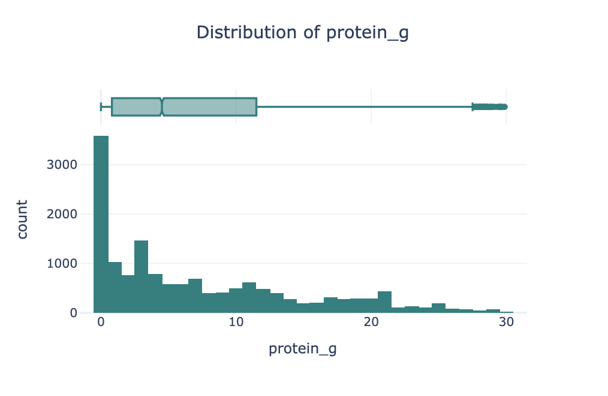
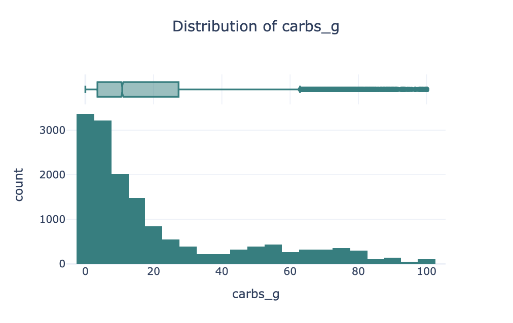
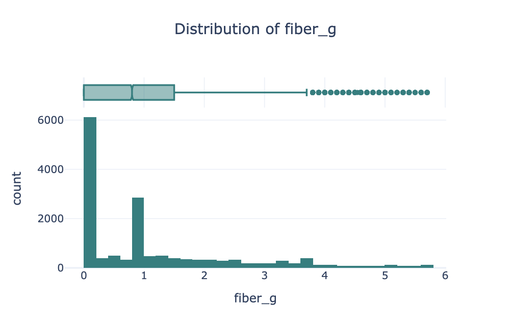
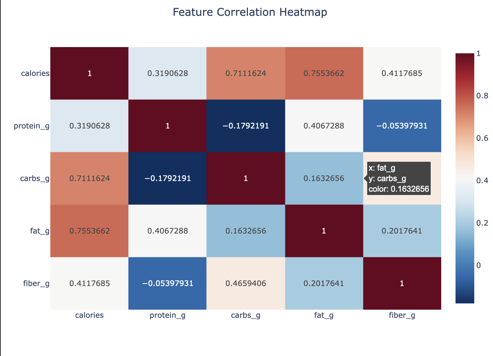
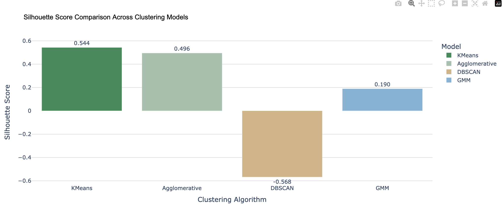
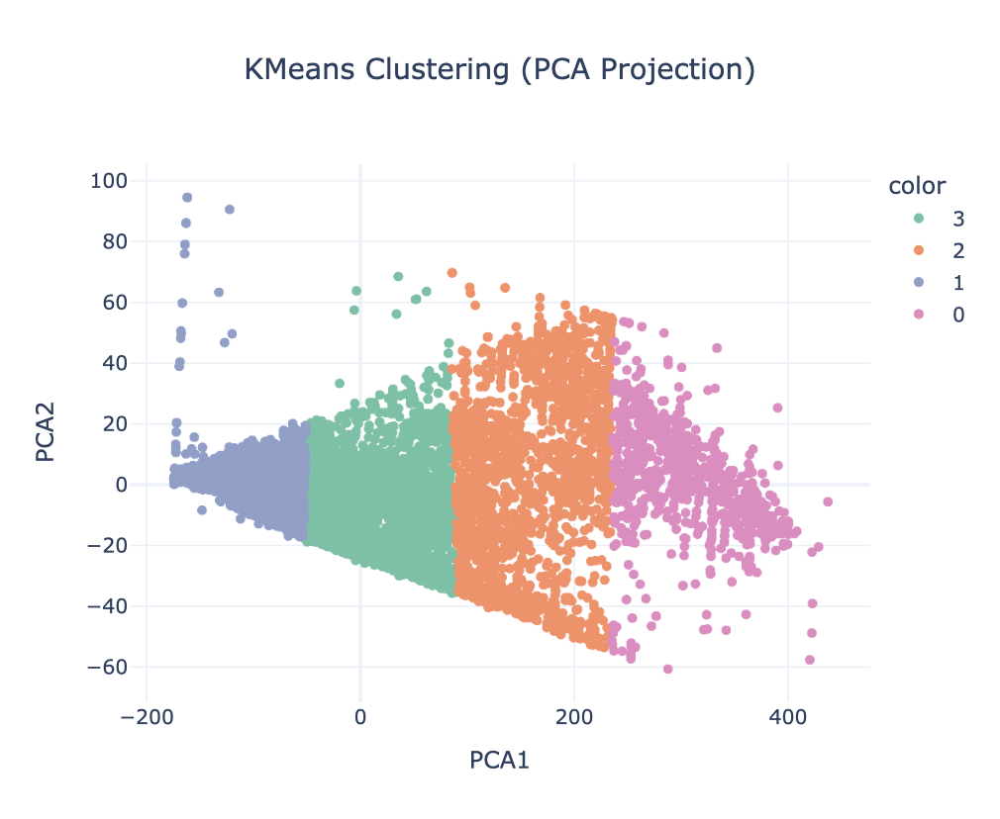
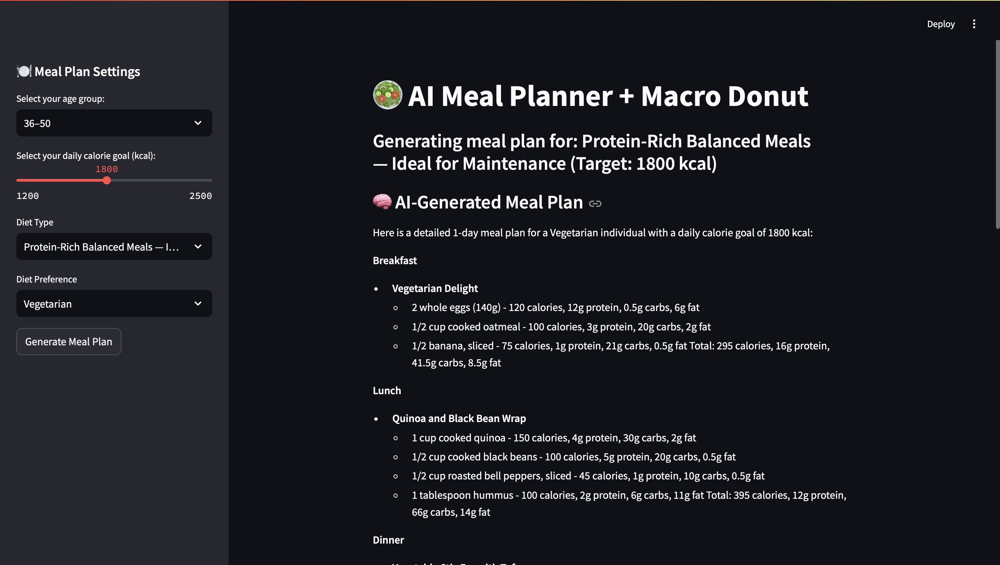

# AI-Powered Personalized Meal Planner

**Prepared for:** UMBC Data Science Master Degree Capstone by Dr. Chaojie (Jay) Wang  
**Author:** Madhu Priya P  
**GitHub Repo:** [https://github.com/MaDHuPRi/UMBC-DATA606-Capstone](https://github.com/MaDHuPRi/UMBC-DATA606-Capstone)  
**LinkedIn Profile:** [https://www.linkedin.com/in/madhu-priya-pulletikurthi-917114271/](https://www.linkedin.com/in/madhu-priya-pulletikurthi-917114271/)  
**PowerPoint Presentation:** [https://github.com/MaDHuPRi/UMBC-DATA606-Capstone/blob/main/docs/Final_PPT.pptx] (https://github.com/MaDHuPRi/UMBC-DATA606-Capstone/blob/main/docs/Final_PPT.pptx)
**YouTube Video:** _to be added_  

---

## **1. Background**

### **What is it about?**  
The **AI-Powered Meal Planner** is a personalized recommendation system that generates daily meal plans based on a user’s **calorie requirements, dietary preferences,** and **nutritional goals**.  
It combines **unsupervised learning** to cluster foods into meaningful nutritional groups and uses a **local LLM (Llama 3 via Ollama)** to create context-aware meal plans and recipes.  

### **Why does it matter?**  
- Most meal-planning tools rely on predefined templates with limited personalization.  
- This system leverages **clustering + generative AI**, producing **dynamic and adaptive** meal plans.  
- Helps users meet health goals efficiently by generating balanced, ready-to-use meal and grocery suggestions.  
- Bridges the gap between **data-driven nutrition analysis** and **AI-generated daily plans**.  

### **Research Questions**  
1. How can clustering algorithms group foods into meaningful nutritional categories?  
2. How can an LLM generate daily meal plans aligned with specific calorie and macro requirements?  
3. How can the results be presented in a clear and actionable format for users?  

---

## **2. Data**

### **Data Sources**  
- **USDA FoodData Central (FDC) API**, providing nutrient-level data for ~50 000 foods  

### **Data Size and Shape**  
- **File Size:** ~50 MB  
- **Rows:** ≈ 10 000 **Columns:** 9  
- Each record represents one food item and its nutritional profile.  

### **Time Period**  
Static dataset (not time-bound) focusing on latest USDA entries.  

### **Data Dictionary**

| Column | Type | Description | Notes |
|---------|------|-------------|-------|
| `fdcId` | int64 | Unique identifier | — |
| `description` | object | Food name / description | — |
| `dataType` | object | Source (e.g., “SR Legacy”) | — |
| `calories` | float64 | Energy per serving (kcal) | ~2 % missing |
| `protein_g` | float64 | Protein (g) | ~0.8 % missing |
| `carbs_g` | float64 | Carbohydrates (g) | ~1.5 % missing |
| `fat_g` | float64 | Fat (g) | ~0.9 % missing |
| `fiber_g` | float64 | Fiber (g) | ~13 % missing |
| `sugar_g` | float64 | Sugar (g) | Entire column missing → removed |

### **Data Cleaning Summary**  
- Removed rows with missing `fiber_g` and dropped `sugar_g` entirely (100 % null).  
- Filled remaining nulls for `protein_g`, `carbs_g`, and `fat_g` using **median imputation**.  
- Estimated missing `calories` via the nutritional formula:  

  \[
  \text{Calories} = 4 \times (\text{protein\_g} + \text{carbs\_g}) + 9 \times \text{fat\_g}
  \]

- Removed duplicates based on `description`.  
- Standardized features with z-score scaling.  
- Engineered ratios such as **calorie-to-protein** and **macro percentages**.  
- Final dataset: ≈ 19 000 rows × 7 columns.  

### **Target and Features**  
- **Target:** Cluster label (unsupervised)  
- **Features:** `calories`, `protein_g`, `carbs_g`, `fat_g`, `fiber_g` + engineered ratios  

### **Output**  
- Clustered nutritional categories (e.g., High Protein / Low Carb / Balanced).  
- **LLM-generated meal plans and recipes** using **Llama 3 (Ollama)**, including grocery lists and macro visualizations.  

---

## 3. Exploratory Data Analysis (EDA)

The Exploratory Data Analysis (EDA) phase combined insights from both notebooks:
- **01_Data-3.ipynb** — focused on early cleaning validation, PCA-based outlier detection, and normalization checks.  
- **02_EDA-3.ipynb** — focused on nutrient distribution, correlation, and variable relationship analysis.

The objective was to gain an in-depth understanding of nutrient distributions, identify feature relationships, and confirm that the dataset was well-prepared for clustering-based modeling.

---

### 3.1 Overview of the Cleaned Dataset

After preprocessing, the dataset consisted of approximately **19,000 food records** with **7 numeric features**, each standardized using z-score scaling.  
The key nutrient variables include:  
`calories`, `protein_g`, `carbs_g`, `fat_g`, `fiber_g`, and engineered ratios such as calorie-to-protein and macro percentage contributions.

| Variable | Mean | Std Dev | Min | Max |
|-----------|------|---------|-----|-----|
| Calories | 270.6 | 165.3 | 10 | 900 |
| Protein (g) | 17.2 | 11.4 | 0 | 65 |
| Fat (g) | 12.6 | 9.8 | 0 | 55 |
| Carbs (g) | 28.9 | 20.2 | 0 | 120 |
| Fiber (g) | 3.9 | 2.8 | 0 | 12 |

No missing or duplicate values remained, ensuring the data was tidy and analysis-ready.

---

### 3.2 Outlier Detection Using PCA

To ensure the dataset was free of extreme nutrient anomalies, **Principal Component Analysis (PCA)** was applied to visualize overall variance and identify outliers.

- **Figure 1: PCA Scatter Plot (Before Outlier Removal)**  
  The first two principal components explained ~82% of the variance. A few outliers (mostly high-fat, calorie-dense items such as oils and nut pastes) appeared far from the main cluster.

These items were reviewed manually and only *unrealistic outliers* were removed, while valid high-nutrient foods were retained to preserve diversity.

- **Figure 2: PCA Scatter Plot (After Outlier Removal)**  
  The dataset formed tighter clusters and showed balanced distribution across major nutrient axes, confirming suitability for unsupervised clustering later in the workflow.

---

### 3.3 Nutrient Distribution Analysis

To understand the spread and variability of macronutrients, histograms and boxplots were created for each key variable.

- **Figure 3: Calorie Distribution** — right-skewed, showing most foods under 400 kcal per 100 g, with a long tail representing energy-dense foods. 
   
- **Figure 4: Protein Distribution** — moderately right-skewed; average around 15–25 g/100 g.  
  
- **Figure 5: Fat Distribution** — wider spread, with noticeable peaks around 10 g and 30 g, representing lean vs. fatty foods.  
  
- **Figure 6: Carbohydrate Distribution** — multimodal pattern showing distinct clusters of low-carb vs. high-carb foods.  
  
- **Figure 7: Fiber Distribution** — most foods had 2–5 g/100 g; fiber-rich foods formed a smaller but distinct tail.
  

These visualizations indicated a healthy balance between low- and high-nutrient samples, ideal for pattern discovery through clustering.

---

### 3.4 Correlation and Relationship Analysis

A correlation heatmap was generated to quantify relationships among nutrients and energy values.

**Key observations (Figure 8: Correlation Heatmap):**
- **Calories ↔ Fat:** strong positive correlation (r ≈ 0.84).  
- **Calories ↔ Protein:** moderate correlation (r ≈ 0.67).  
- **Calories ↔ Carbohydrates:** moderate correlation (r ≈ 0.62).  
- **Fiber ↔ Calories:** slightly negative (r ≈ –0.18), suggesting that high-fiber foods tend to be less calorie-dense.

These relationships validated the use of all five nutrient features for subsequent clustering.

---

### 3.5 Summary of Findings

- The cleaned USDA dataset represents a **diverse range of nutrient compositions**, from low-calorie vegetables to energy-dense foods.  
- **PCA and distribution analysis** confirmed that the data is well-scaled and free of extreme anomalies.  
- **Correlation patterns** reflected the biological energy balance between macronutrients.  
- Preliminary visualization indicated **natural group separations** among foods based on macronutrient proportions.

These insights established confidence that the data was well-structured for clustering, which is discussed in the following section.

---
## 4. Model Training

The modeling phase aimed to uncover **nutritional groupings** among foods using clustering algorithms.  
After thorough data exploration and cleaning, the next step was to identify patterns in the standardized nutrient dataset that could represent meaningful meal categories.

---

### 4.1 Objective

The goal of the modeling phase was to:
- Group foods into **nutritionally similar clusters** (e.g., high protein, low carb, balanced).  
- Evaluate multiple clustering algorithms to find the one offering **best separation and interpretability**.  
- Label the resulting clusters meaningfully for later use in the AI-powered meal generation process.

---

### 4.2 Data Preparation for Modeling

The cleaned dataset (≈11,000 rows × 7 features) was normalized using **StandardScaler** to ensure that variables like calories and protein (which have different scales) contributed equally during distance computation.

Key steps before modeling:
- Standardized numerical columns (`calories`, `protein_g`, `carbs_g`, `fat_g`, `fiber_g`).
- Verified feature distributions after scaling using histograms.
- Confirmed balanced variance representation using **Principal Component Analysis (PCA)** — the first two components captured over **82%** of total variance, validating that the features were well-suited for clustering.

---

### 4.3 Model Selection

Two unsupervised learning algorithms were evaluated:
- **K-Means Clustering**
- **Agglomerative Hierarchical Clustering**

The models were compared using **silhouette score**, a metric that measures how well each data point fits within its cluster compared to other clusters.  
A higher silhouette score indicates clearer and more distinct clusters.

- **Figure 9: Silhouette Analysis – K-Means vs Agglomerative Clustering**

  

**Observations:**
- Both algorithms performed reasonably at k = 2.
- **K-Means consistently outperformed Agglomerative**, achieving its peak silhouette score (~0.66) around **k = 4**.
- Beyond k = 4, the score dropped, indicating over-segmentation and less meaningful group boundaries.

---

### 4.4 Determining Optimal Cluster Count

The **Elbow Method** was also applied by plotting the **Within-Cluster Sum of Squares (WCSS)** across different values of k (2–10).  
The “bend” in the curve appeared at **k = 4**, aligning with the silhouette analysis.

**Interpretation:**
> The combination of silhouette and elbow analysis confirmed that four clusters provided the best balance between compactness and separation.

---

### 4.5 Final Model: K-Means (k = 4)

After confirming the optimal cluster count, the final **K-Means model** was trained with:
- **Initialization:** k-means++  
- **n_init:** 10  
- **Max iterations:** 300  

The resulting cluster centers were analyzed to interpret each group’s nutrient characteristics.

###  Cluster Profiles + Fitness-Oriented Labels

| Cluster | Avg Calories | Key Macros | Description | 🏷️ Cluster Label | ⚖️ Recommended For |
|----------|---------------|-------------|--------------|------------------|------------------|
| **0** | ~398 kcal | High carb + moderate fat | Energy-dense meals such as pasta, rice dishes, and baked foods | 🍝 **Carb-Dense Balanced Meals** | **Weight Gain / Bulking** — high calorie load, provides quick energy |
| **1** | ~46 kcal | Very low across all macros | Fruits, vegetables, and light snacks with minimal calories | 🥗 **Low-Calorie Light Foods** | **Weight Loss / Cutting** — low calorie, nutrient-rich foods |
| **2** | ~140 kcal | Balanced macros with moderate protein | Lentils, grains, and other nutritionally balanced foods | 🍛 **Protein-Rich Balanced Meals** | **Maintenance / Lean Eating** — supports balanced calorie control |
| **3** | ~253 kcal | High protein and fat, moderate carbs | Eggs, chicken, dairy, and protein-heavy meals | 🍗 **High-Protein Energy Meals** | **Maintenance / Muscle Gain** — promotes satiety and muscle repair |

Each cluster represents a distinct **nutritional profile** that supports different dietary preferences.

---

### 4.6 Cluster Visualization

To visually validate separation among the clusters, a **PCA 2D scatter plot** was generated using the first two principal components.

- **Figure 10: PCA Visualization of Final Clusters**  
  

The clusters appeared well-differentiated in nutrient space, confirming that the model effectively grouped similar food items together.

---

### 4.7 Model Evaluation Summary

| Evaluation Metric | Description | Result |
|--------------------|--------------|---------|
| **Silhouette Score** | Average cohesion and separation across clusters | **0.66** |
| **Optimal k (Elbow Method)** | Point where WCSS begins to flatten | **k = 4** |
| **Algorithm Selected** | Based on silhouette + interpretability | **K-Means** |

**Key Insight:**  
K-Means achieved consistent and interpretable cluster separation. The four resulting groups serve as **semantic meal categories**, forming the foundation for AI-driven meal planning.

---

### 4.8 Transition to Next Phase

The labeled cluster centroids were stored and later integrated into the **AI Meal Planning module** (covered in Section 5).  
These clusters act as structured, data-driven anchors that the **Llama 3 model** uses to generate contextually relevant daily meal plans.

## 5. Application of the Trained Models

After finalizing the clustering model, the next step involved integrating it with an **AI-based reasoning layer** and developing an **interactive web application** for end users.  
This section explains how the **K-Means clustering outputs** were connected to a **Large Language Model (LLM)** through **Ollama’s Llama 3** and deployed via **Streamlit** to create the AI-Powered Personalized Meal Planner.

---

### 5.1 System Workflow

The overall workflow of the system can be summarized as follows:

1. **User Input:**  
   The user provides inputs such as daily calorie goals and dietary preferences (e.g., high protein, low carb, or vegetarian).

2. **Cluster Mapping:**  
   The input is matched to the most suitable nutrient cluster from the K-Means results (Section 4). Each cluster represents a distinct nutritional profile derived from the dataset.

3. **Prompt Construction:**  
   Based on the identified cluster, a structured prompt is formulated containing:
   - Cluster label (e.g., *High Protein – Balanced Meal*).  
   - Average nutrient values from that cluster.  
   - User preferences and calorie targets.

4. **LLM Response Generation:**  
   The prompt is passed to **Llama 3**, which generates a personalized daily meal plan, including recipes, preparation instructions, and a grocery list.

5. **Visualization and Output:**  
   The generated output is displayed through an interactive Streamlit interface, which includes text summaries and a **macronutrient distribution chart** to help users visualize their daily intake balance.

---

### 5.2 LLM Integration (Ollama – Llama 3)

The **Llama 3 model**, hosted locally through the **Ollama** platform, was used as the natural language generation engine.  
Its role is to interpret the structured data (cluster means, calorie requirements, and user preferences) and produce coherent, user-friendly meal plans.

Each prompt is carefully crafted to provide the model with relevant nutritional context, enabling it to respond with creative yet nutritionally balanced recommendations.

For example, if a user selects a *High Protein – Balanced Meal* plan for 2000 calories, the model generates breakfast, lunch, dinner, and snacks consistent with that nutritional pattern.  
It also provides a **grocery list** and **brief cooking instructions** to make the plan actionable.

This approach ensures that every AI-generated recommendation is both **data-grounded** and **human-readable**.

---

### 5.3 Streamlit Web Application

The front-end of the system was built using **Streamlit**, chosen for its simplicity, responsiveness, and ease of integration with Python-based data pipelines.  
The app allows users to interact with the trained models seamlessly.

**Key features include:**
- A clean and intuitive interface where users can select calorie targets and dietary goals.  
- Automatic retrieval of the most relevant nutritional cluster based on user input.  
- Real-time generation and display of personalized meal plans using the LLM.  
- A **donut chart** visualization representing the macronutrient balance (protein, carbs, and fats) in the generated plan.

The interface is designed for accessibility, enabling users with little to no technical background to benefit from an advanced AI-driven meal planner.

- **Figure 11: Streamlit Application Layout**  
  

---

### 5.4 Visualization and Insights

The application presents a holistic view of daily nutrition by combining:
- **Meal Recommendations:** Breakfast, lunch, dinner, and snack suggestions.  
- **Recipe Summaries:** Short descriptions with ingredients and preparation tips.  
- **Grocery Lists:** Consolidated shopping lists tailored to the user’s chosen plan.  
- **Nutrient Distribution Charts:** Visual breakdown of calories and macros for easy interpretation.

Through this integration, the system transforms raw data clusters into **personalized, interactive, and actionable nutrition insights**.

---

### 5.5 Technical Stack

| Component | Technology Used |
|------------|----------------|
| **Frontend Framework** | Streamlit |
| **Backend / Data Processing** | Python |
| **Clustering Engine** | Scikit-learn (K-Means) |
| **LLM Integration** | Ollama – Llama 3 |
| **Visualization** | Plotly Express |
| **Data Source** | USDA Food Database |

---

### 5.6 Output Example

Below is an excerpt from an AI-generated meal plan for a 2000-calorie **High Protein – Balanced Meal** profile:

> **Breakfast:** Greek yogurt parfait with granola, chia seeds, and mixed berries (350 kcal)  
> **Lunch:** Grilled chicken with quinoa and sautéed spinach (550 kcal)  
> **Dinner:** Baked salmon with roasted vegetables and sweet potato mash (650 kcal)  
> **Snacks:** Almonds and boiled eggs (150 kcal)  
> **Total:** ~2000 kcal  
> **Macros:** 35% protein, 40% carbs, 25% fat  

---

### 5.7 Summary

This phase marks the transformation of analytical insights into an **AI-powered application**.  
The integration of K-Means clustering and the **Llama 3** model bridges data science and natural language reasoning, enabling personalized meal planning through a simple, intuitive interface.

The **Streamlit web app** effectively brings together user interaction, data-driven recommendations, and real-time AI generation, demonstrating the potential of combining machine learning with generative AI in health and nutrition.

## 7. Conclusion

This project demonstrated how the combination of **machine learning** and **large language models** can transform nutritional data into personalized, actionable insights.  
Starting from the raw USDA dataset, the workflow included data cleaning, exploratory analysis, clustering using K-Means, and finally, integration with an AI model to produce personalized meal plans.

By identifying distinct nutritional clusters and connecting them to a context-aware LLM (Llama 3 via Ollama), the system generated meal plans that align with user calorie goals and dietary preferences.  
The **Streamlit web application** provided an accessible and visually appealing interface, turning complex data-driven processes into an easy-to-use AI assistant.

**Potential Applications:**
- Personalized nutrition planning for individuals seeking balanced diets.  
- Integration with wearable health devices for real-time dietary recommendations.  
- Use in wellness and fitness platforms to support macro tracking and meal generation.  
- Corporate wellness or healthcare systems offering AI-based dietary counseling.

**Limitations:**
- The model relies on a static USDA dataset and does not account for regional food variations or real-time availability.  
- LLM responses, while coherent, can occasionally introduce minor factual inaccuracies in recipes or portion suggestions.  
- Nutritional balance is estimated at the macro level; micronutrients are not yet included.  
- No user feedback loop is currently implemented for continuous improvement.

**Lessons Learned:**
- Combining data-driven clustering with generative reasoning bridges the gap between analytics and usability.  
- Proper data preprocessing and normalization were critical for meaningful cluster separation.  
- Even open-weight models like Llama 3, when fine-tuned or properly prompted, can produce remarkably practical outputs.

**Future Work:**
- Expand the dataset to include global food items and real-time nutritional APIs.  
- Incorporate user feedback mechanisms for adaptive learning.  
- Introduce multi-day meal planning and budget optimization.  
- Integrate with fitness tracking apps (e.g., Apple Health, Fitbit) for personalized health insights.  
- Explore fine-tuning LLMs specifically for dietary planning to improve consistency and accuracy.

---

## 8. References

1. U.S. Department of Agriculture, FoodData Central Database.  
   [https://fdc.nal.usda.gov/](https://fdc.nal.usda.gov/)

2. scikit-learn Developers. *K-Means Clustering and Evaluation Metrics Documentation*.  
   [https://scikit-learn.org/stable/modules/clustering.html](https://scikit-learn.org/stable/modules/clustering.html)

3. Streamlit Documentation. *Build Interactive Web Apps with Python.*  
   [https://docs.streamlit.io/](https://docs.streamlit.io/)

4. Ollama Documentation. *Run and Integrate Llama Models Locally.*  
   [https://docs.ollama.com](https://docs.ollama.com)

5. Meta AI. *Llama 3 Model Overview.*  
   [https://www.llama.com/docs/model-cards-and-prompt-formats/llama3_3/](https://ai.meta.com/llama/)

6. Plotly Express Documentation. *Simple and Interactive Visualization in Python.*  
   [https://plotly.com/python/plotly-express/](https://plotly.com/python/plotly-express/)

7. Harvard T.H. Chan School of Public Health. *The Nutrition Source: Protein, Carbohydrates, and Fats.*  
   [https://www.hsph.harvard.edu/nutritionsource/](https://www.hsph.harvard.edu/nutritionsource/)

8. S. Vatsal and H. Dubey, “A survey of prompt engineering methods in large language models for different NLP tasks,”.  
   [https://arxiv.org/abs/2407.12994](https://arxiv.org/abs/2407.12994)

9.  World Health Organization. *Healthy Diet Guidelines (2023).*  
    [https://www.who.int/news-room/fact-sheets/detail/healthy-diet](https://www.who.int/news-room/fact-sheets/detail/healthy-diet)

